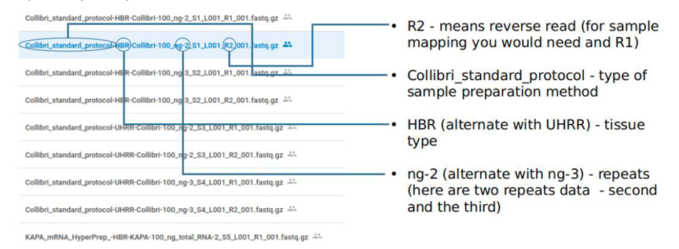
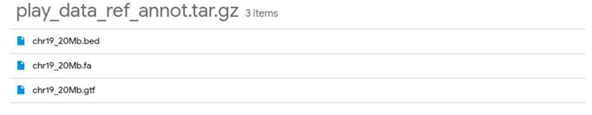

# Pactical task on Transcriptomics 
System Biology 1k

## Data
1. The needed data of a real sequencing (matching  a short genome fragment):
https://drive.google.com/drive/folders/1Dq0GENE2MUshQNj2XV36iLlNReBz9KzB?usp=sharing

2. The genome and annotation data: 
https://drive.google.com/file/d/12PIhREN1oRM_gsCgA4ODhhPUkJt-MLyo/view

## Task
Please create a snakemake workflow which would:
1. evaluate  "raw" reads quality via FastQC;
2. create a raport via MultiQC;
3. trim a barcodes with bbduk. 

Adapter file  (adapters.fa) should containi:
"""
>Adapter_1
AGATCGGAAGAGCACACGTCTGAACTCCAGTCA
>Adapter_2
AGATCGGAAGAGCGTCGTGTAGGGAAAGAGTGT
"""
Use these options:
 ref=adapters.fa ktrim=r k=23 mink=11 hdist=1 tpe tbo qtrim=r trimq=10 

"Google it" for the meaning of the options.
 

4. run FastQC analysis for the trimmed reads.
5. create a separate raport on the trimmed reads raport for MultiQC.;

Compare FastQC/MultiQC output for trimmed and not trimmed reads. What indicates that adapters were successfully removed.

6. Add STAR aligner step to the workflow (this would include two steps and genome indexing).

a) Star manual https://github.com/alexdobin/STAR/blob/master/doc/STARmanual.pdf will be your friend.
b) Use --outSAMtype BAM SortedByCoordinate to get a sorted alignment file.

7. Add a step that indexes the output bam with samtools index
Add counting step with featureCounts http://bioinf.wehi.edu.au/featureCounts/

Use a command line like:
“featureCounts -p -t exon -g gene_id -a annotation.gtf -o counts.txt mapping_results_PE.bam -s {1 or 2}.”

Please take note that either 1 or 2 value for -s is needed. That is due to strand specificity. Please google it ... check out
https://www.ecseq.com/support/ngs/how-do-strand-specific-sequencing-protocols-work

In practice for each library test either 1 or 2. The “proper” value would the one giving higher count numbers. Which library in this set would be the special one and would be different from others?

Collect data on alignment rate per sample (look for fraction of uniquely mapped reads). Are there any differences that could be related to tissue types and/or sample preparation preparation methods?

What strand specificity settings should be used for each sample preparation method. Illustrate by one example what happens if a wrong setting are used?

NOTE on featureCounts: sorted by name bam might be needed. Use samtools sort -n.
-s must be adjusted. Explore possibility to analyse multiple bams (all from the the same sample preparation method - don't mix different sample preparation methods as strandedness parameters might not match). 
Try to find solution to run analyses for all samples using one config file and one run (...how to deal with strandedness...)
---- Snakemake workflow up to here...--- after this point you can either do 8-11 steps as separate notebooks/ Rmarkdown files or integrate into the workflow.

8. For each sample preparation method perform a DE analysis comparing UHRRvsHBR. UHRR is a sample originating from several cancerous cell lines,HBR represents “normal” sample:
●use DESeq2 (nice sample workflow is here http://bioconductor.org/packages/devel/bioc/vignettes/DESeq2/inst/doc/DESeq2.html#count-matrix-input); Explore the section on“Countmatrixinput”and down...
●Make sure that sample names match in counts and column data tables.
●The output should be:
■ a listof DE genes wit Padj values.
■Vulcanplot.

9. Create a PCA plot exploring how different sample preparation plots cluster based on deferentially expressed genes (use genes that are DE for all sample preparation methods)
10. Look at the  fgsea tutorial. https://bioconductor.org/packages/devel/bioc/vignettes/fgsea/inst/doc/fgsea-tutorial.html
11. Which fold changes you should use - shrunken or not for the enrichment analysis? Make an R script testing enrichment for the Reactome pathways. Are there any cancer related enriched pathways? Are there any differences in results matching different sample preparation kits.  
